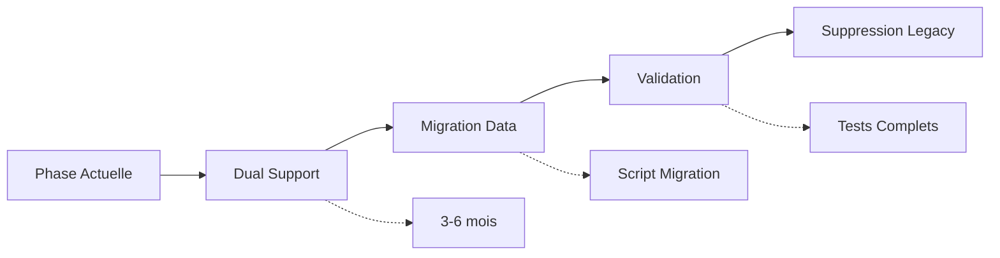

# 🚨 Analyse des Risques - Phase de Nettoyage (Phase 9)

## 📊 Vue d'ensemble

Suite à l'analyse approfondie des références restantes à `contactId` dans le codebase, voici l'évaluation des risques pour la phase de nettoyage.

## ✅ Fichiers à Supprimer Sans Risque

### 1. **Fichiers déjà supprimés (git status)**
- ✅ `ContactSearchSection.js` - Remplacé par UnifiedContactSelector
- ✅ `LieuContactSearchSection.js` - Remplacé par UnifiedContactSelector  
- ✅ `ContactSearchSectionWithRoles.js` - Non utilisé
- ✅ `useConcertFormFixed.js` - Remplacé par useConcertForm moderne
- ✅ `check-lieu-contact-detailed.js` - Script de debug
- ✅ `OrganizationIdDebug.js` - Script de debug

**Risque : AUCUN** - Ces fichiers sont déjà supprimés et remplacés.

### 2. **Scripts de debug/test additionnels**
- `src/components/debug/ContactCreationTester.js`
- `src/components/debug/EntityCreationTester.js`
- `src/utils/debugRelancesAutomatiques.js`
- `src/__tests__/integration/contactCreationFromForms.test.js`

**Risque : FAIBLE** - Scripts de développement uniquement.

## ⚠️ Fichiers à Conserver pour Rétrocompatibilité

### 1. **Hooks de Validation de Formulaires**
📍 `useValidationBatchActions.js` (lignes 98, 130, 331)
```javascript
// Ligne 98-99: Support du contact existant
let programmId = concertData.contactId || formData.programmId;

// Ligne 130-132: Mise à jour du concert avec contactId
await updateDoc(doc(db, 'concerts', concertId), {
  contactId: programmId
});

// Ligne 331-333: Ajout de la référence au contact
if (programmId) {
  concertUpdates.contactId = programmId;
}
```
**Risque de suppression : ÉLEVÉ**
- Gère les soumissions de formulaires publics en cours
- Migration automatique `contactId` → `contactIds` pour nouveaux concerts
- Nécessaire pour la continuité des formulaires existants

### 2. **Hooks de Contrats**
📍 `useContratDetails.js` (lignes 95, 101, 239, 245)
```javascript
// Récupération du contact via le concert
if (!concertData.contactId) {
  console.log('[DEBUG] Pas de contactId dans le concert');
  return null;
}
```
**Risque de suppression : ÉLEVÉ**
- Génération de contrats pour concerts existants
- Factures et documents légaux dépendent de ces données
- Impact direct sur la facturation

📍 `useContratGeneratorWithRoles.js` (lignes 110, 112)
- ✅ Déjà mis à jour avec support des deux formats

### 3. **Services Critiques**
📍 `historiqueEchangesService.js` (lignes 123, 230)
```javascript
// Requête historique par contactId
where('contactId', '==', contactId)
```
**Risque de suppression : TRÈS ÉLEVÉ**
- Historique complet des échanges clients
- Données de suivi commercial
- Traçabilité légale requise

📍 `relancesAutomatiquesService.js` (ligne 228)
```javascript
const champsEssentiels = ['titre', 'date', 'lieuId', 'artisteId', 'contactId'];
```
**Risque de suppression : ÉLEVÉ**
- Système de relances automatiques actif
- Workflows métier en cours

### 4. **Hooks de Détails d'Entités**
📍 `useLieuDetails.js` (lignes 88, 97-105)
```javascript
// Support multi-méthodes pour trouver le contact
if (lieuData.contactId) {
  // Méthode 1: contactId direct (rétrocompatibilité)
}
```
**Risque de suppression : MOYEN**
- Chargement des relations existantes
- Fallback vers nouveau format `contactIds`

📍 `useStructureDetails.js` (ligne 246)
```javascript
// Recherche concerts via contact
where('contactId', '==', contactId)
```
**Risque de suppression : MOYEN**
- Recherche de concerts historiques

### 5. **Pages d'Interface**
📍 `ContratsPage.js` (lignes 64, 66)
```javascript
// Chargement du nom du contact si manquant
if (concertData.contactId && !concertData.contactNom) {
```
**Risque de suppression : MOYEN**
- Affichage des contrats existants
- Interface utilisateur

## 🔧 Fichiers à Modifier

### 1. **useConcertWatcher.js** (ligne 126) ✅
**Statut** : Déjà mis à jour pour surveiller `contactIds`
```javascript
'contactIds', // Nouveau format unifié (remplace contactId)
```

### 2. **ConcertsList.js** (lignes 183, 299)
**Action requise** : Mettre à jour les filtres et la détection de contacts
```javascript
// Ligne 183 - Filtre de recherche
field: 'contactId', // À mettre à jour vers 'contactIds'

// Ligne 299 - Détection de contact
const hasContact = (concert.contactIds && concert.contactIds.length > 0) || concert.contactId;
// Déjà compatible avec les deux formats ✅
```
**Risque si non modifié : FAIBLE** - Filtrage incomplet mais rétrocompatible

## 📋 Plan de Nettoyage Recommandé

### Phase 9A : Nettoyage Immédiat ✅
1. Supprimer tous les scripts de debug/test
2. Nettoyer les imports non utilisés
3. Supprimer les commentaires obsolètes

### Phase 9B : Migration Progressive (3-6 mois)
1. **Ajouter des commentaires de rétrocompatibilité**
   ```javascript
   // RÉTROCOMPATIBILITÉ: Support contactId pour concerts < 2025
   // TODO: Supprimer après migration complète (Q3 2025)
   ```

2. **Créer un script de migration des données**
   - Convertir tous les `contactId` en `contactIds: [contactId]`
   - Mettre à jour les index Firestore
   - Valider l'intégrité des données

3. **Monitoring et logs**
   - Logger l'utilisation de `contactId` vs `contactIds`
   - Identifier les concerts non migrés
   - Alertes sur utilisation legacy

### Phase 9C : Suppression Définitive (6+ mois)
1. Analyser les logs pour confirmer 0 utilisation legacy
2. Backup complet avant suppression
3. Supprimer progressivement par module

## 🎯 Recommandations Critiques

### ❌ NE PAS SUPPRIMER
1. **useValidationBatchActions.js** - Formulaires actifs
2. **useContratDetails.js** - Génération contrats/factures
3. **historiqueEchangesService.js** - Historique légal
4. **relancesAutomatiquesService.js** - Workflows actifs

### ⚠️ MODIFIER AVEC PRUDENCE
1. Toujours maintenir le fallback `contactId` → `contactIds`
2. Tester avec des concerts pré-2025
3. Valider la génération de contrats/factures

### ✅ SAFE TO DELETE
1. Scripts de debug (`*Debug.js`)
2. Tests obsolètes
3. Composants UI remplacés

## 📊 Métriques de Risque

| Composant | Risque | Impact Business | Action |
|-----------|---------|-----------------|---------|
| Validation Formulaires | 🔴 Élevé | Soumissions bloquées | Conserver |
| Génération Contrats | 🔴 Élevé | Facturation impossible | Conserver |
| Historique Échanges | 🔴 Très Élevé | Perte données légales | Conserver |
| Relances Auto | 🟠 Moyen | Workflows interrompus | Conserver |
| Scripts Debug | 🟢 Faible | Aucun | Supprimer |

## 🔄 Stratégie de Migration



## 📝 Fichiers avec Double Support (contactId + contactIds)

Ces fichiers supportent déjà les deux formats et assurent la rétrocompatibilité :

1. **ConcertsList.js** - Détection intelligente des contacts
2. **UnifiedContactSelector.js** - Gestion unifiée des formats
3. **useContratGeneratorWithRoles.js** - Support dual pour génération
4. **ConcertForm.js** - Formulaire avec migration automatique
5. **useConcertDetails.js** - Chargement avec fallback

## ✅ Checklist Avant Suppression

- [ ] Tous les concerts ont `contactIds` (pas seulement `contactId`)
- [ ] Aucune soumission de formulaire en attente
- [ ] Tous les contrats générés avec succès
- [ ] Historique des échanges accessible
- [ ] Relances automatiques fonctionnelles
- [ ] Backup complet effectué
- [ ] Tests de régression passés

---

*Document créé le 2025-01-27 - Phase 9 Unification des Contacts*